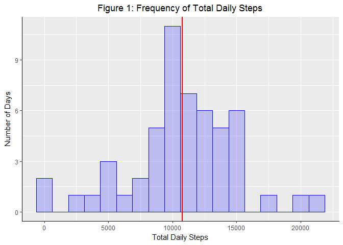
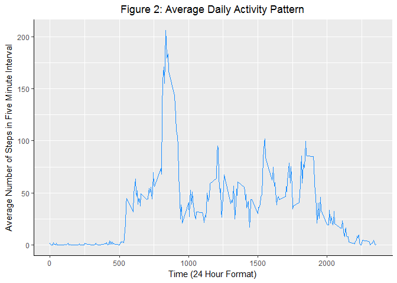
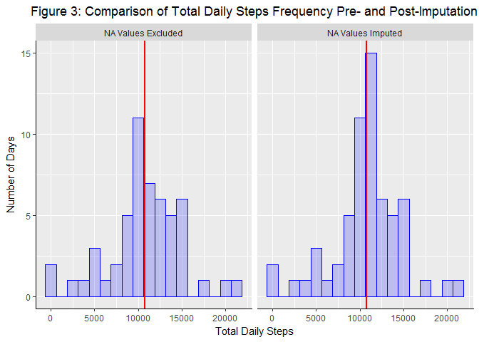
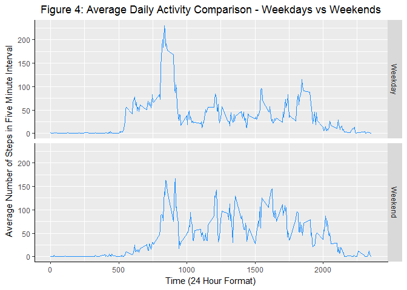

# Reproducible Research: Peer Assessment 1
Geoff Skellams  


## Loading and preprocessing the data

The requirements for this section were:

> Show any code that is needed to
>
> 1. Load the data (i.e. read.csv())  
> 2. Process/transform the data (if necessary) into a format suitable for your analysis


The data is found in the file **activity.csv**, which is contained in the **activity.zip** file. The zip file is 
already downloaded as part of this repository.

The CSV file contains data in three separate columns, as explained in the original assignment description:

> The variables included in this dataset are:
> 
> * **steps:** Number of steps taking in a 5-minute interval (missing values are coded as NA)
> * **date:** The date on which the measurement was taken in YYYY-MM-DD format
> * **interval:** Identifier for the 5-minute interval in which measurement was taken


```r
# set some knitr options. Messages and warnings from the R code chunks are suppressed to clean up the output.
knitr::opts_chunk$set(echo = TRUE, message = FALSE, warning = FALSE, fig.align="center")

# import the libraries we'll need later on
library(dplyr)
library(ggplot2)

# check to see if the actvity.csv file exists. If it doesn't, unpack the zip file in this folder
if (!file.exists("activity.csv"))
{
    unzip("./activity.zip")
}

# read in the activity data
activityData <- read.csv("activity.csv")

# convert the date column to a proper date format
activityData$date <- as.Date(as.character(activityData$date))

# put out some information on the activityData
summary(activityData)
```

```
##      steps             date               interval     
##  Min.   :  0.00   Min.   :2012-10-01   Min.   :   0.0  
##  1st Qu.:  0.00   1st Qu.:2012-10-16   1st Qu.: 588.8  
##  Median :  0.00   Median :2012-10-31   Median :1177.5  
##  Mean   : 37.38   Mean   :2012-10-31   Mean   :1177.5  
##  3rd Qu.: 12.00   3rd Qu.:2012-11-15   3rd Qu.:1766.2  
##  Max.   :806.00   Max.   :2012-11-30   Max.   :2355.0  
##  NA's   :2304
```

* * * *
## What is mean total number of steps taken per day?

The requirements for this section were:

> For this part of the assignment, you can ignore the missing values in the dataset.
> 
> 1. Calculate the total number of steps taken per day
> 2. If you do not understand the difference between a histogram and a barplot, research the difference between them.  Make a histogram of the total number of steps taken each day
> 3. Calculate and report the mean and median of the total number of steps taken per day

In order to discover the average number of steps taken each day, we first need to calculate the sum of the steps taken on each day. To do this, we group the data by date and then summarise it using the sum() function.

A histogram of the total number of steps taken per day is shown in **Figure 1**, below the R source code.


```r
# sum the number of steps per day
stepsPerDay <- group_by(activityData, date) %>% summarize(totalSteps = sum(steps))

# calculate the mean and median of the total daily steps.
meanDailySteps <- mean(stepsPerDay$totalSteps, na.rm = TRUE)
medianDailySteps <- median(stepsPerDay$totalSteps, na.rm = TRUE)

# create a histogram of the total number of daily steps
dsPlot <- ggplot(stepsPerDay, aes(totalSteps)) +     
          geom_histogram(binwidth = 1250, col="blue", fill="blue", alpha = 0.2) + 
          labs(x = "Total Daily Steps") +
          labs(y = "Number of Days") +
          labs(title = "Figure 1: Frequency of Total Daily Steps") + 
          theme(plot.title = element_text(hjust = 0.5)) +
          theme(axis.line.x = element_line(color="black", size = 0.5),
                axis.line.y = element_line(color="black", size = 0.5)) +
          geom_vline(xintercept = meanDailySteps, color="red", size = 1)

# create the actual plot graphic
print(dsPlot)
```



The mean total daily steps (shown as a red line on the histogram) is **10766.19**.

The median total daily steps is **10765**.

* * * *
## What is the average daily activity pattern?

The requirements for this section were:

> 1. Make a time series plot (i.e. type = "l") of the 5-minute interval (x-axis) and the average number of steps taken, averaged across all days (y-axis)
> 2. Which 5-minute interval, on average across all the days in the dataset, contains the maximum number of steps?

The original data, loaded as **activityData**, features a variable **interval**. This is a string representing the time in 24-Hour format, with a value every five minutes. By grouping by this variable, the subjects's average number of steps taken in any five minute window across the two months can be easily calculated.

The results of these calculations are shown in **Figure 2**, below.

The most active time is the interval with the highest average number of steps.


```r
# calculate the daily activity
dailyActivity <- group_by(activityData, interval) %>% summarize(intervalMean = mean(steps, na.rm = TRUE))

# determine the time at which the subject was the most active on average
mostActiveTime <- dailyActivity$interval[[which.max(dailyActivity$intervalMean)]]
formattedMostActiveTime <- sprintf("%04d", strtoi(mostActiveTime))

# create the plot and its options
daPlot <- ggplot(dailyActivity, aes(interval, intervalMean)) +
          geom_line(color = "dodgerblue1") +
          labs(x = "Time (24 Hour Format)") +
          labs(y = "Average Number of Steps in Five Minute Interval") +
          labs(title = "Figure 2: Average Daily Activity Pattern") + 
          theme(plot.title = element_text(hjust = 0.5)) +
          theme(axis.line.x = element_line(color="black", size = 0.5),
                axis.line.y = element_line(color="black", size = 0.5))
    
# create the actual plot graphic
print(daPlot)
```



The subject's most active time, averaged across all days in the data, is **0835**.

* * * *
## Imputing missing values

The requirements for this section were:

> Note that there are a number of days/intervals where there are missing values (coded as NA). The presence of missing days may introduce bias into some calculations or summaries of the data.
> 
> 1. Calculate and report the total number of missing values in the dataset (i.e. the total number of rows with NAs)
> 2. Devise a strategy for filling in all of the missing values in the dataset. The strategy does not need to be sophisticated. For example, you could use the mean/median for that day, or the mean for that 5-minute interval, etc.
> 3. Create a new dataset that is equal to the original dataset but with the missing data filled in.
> 4. Make a histogram of the total number of steps taken each day and Calculate and report the mean and median total number of steps taken per day. Do these values differ from the estimates from the first part of the assignment? What is the impact of imputing missing data on the estimates of the total daily number of steps?

Following the suggestion in the requirements, the NA values in the **steps** variable are replaced with the mean of the corresponding five minute interval, calculated in the previous section. By selecting the mean for the corresponding five minute interval, this should hopefully minimise any introduced error.

**Figure 3** shows a comparison plot between the original histogram (previously shown in **Figure 1**) and the corresponding histogram with the missing values imputed.


```r
# determine which values are missing from the steps column
stepsMissing <- is.na(activityData$steps)

# count the number of missing values
naCount <- sum(stepsMissing)

# take a copy of the raw data
completedActivityData <- activityData

# replace the NA values with the mean of the corresponding time interval
for (missingIndex in which(stepsMissing))
{
    interval <- completedActivityData$interval[missingIndex]
    whichIntervals <- which(dailyActivity$interval == interval)
    completedActivityData$steps[missingIndex] <- dailyActivity$intervalMean[whichIntervals]
}

# make a copy of the original steps per day dataframe and add a column with a descriptive string
stepsPerDay1 <- stepsPerDay
stepsPerDay1$version <- rep("NA Values Excluded", length(stepsPerDay1$totalSteps))

# sum the number of steps per day in the completed data frame, and add a descriptive column
stepsPerDayFull <- group_by(completedActivityData, date) %>% summarize(totalSteps = sum(steps))
stepsPerDayFull$version <- rep("NA Values Imputed", length(stepsPerDayFull$totalSteps))

# combine the two data frames
combinedStepsPerDay <- rbind(stepsPerDay1, stepsPerDayFull)

# calculate the mean and median of the total daily steps.
meanDailyStepsFull <- mean(stepsPerDayFull$totalSteps)
medianDailyStepsFull <- median(stepsPerDayFull$totalSteps)

# create a histogram of the total number of daily steps
dsPlot2 <- ggplot(combinedStepsPerDay, aes(totalSteps)) +     
           geom_histogram(binwidth = 1250, col="blue", fill="blue", alpha = 0.2) + 
           labs(x = "Total Daily Steps") +
           labs(y = "Number of Days") +
           labs(title = "Figure 3: Comparison of Total Daily Steps Frequency Pre- and Post-Imputation") + 
           theme(plot.title = element_text(hjust = 0.5)) +
           theme(axis.line.x = element_line(color="black", size = 0.5),
                 axis.line.y = element_line(color="black", size = 0.5)) +
           geom_vline(xintercept = meanDailyStepsFull, color="red", size = 1) +
           facet_grid(.~version)

print(dsPlot2)
```



As can be see from a comparison of the two plots, the replacement of the NA values with the mean value for the corresponding inverval adds **eight days** worth of data to the bin containing the overall mean. No other bin's values are altered by the imputation of the missing data points.

#### Requirement 1: Number of missing values in the activity dataset

The number of missing values in the activity dataset is **2304**.

#### Reqiurement 4: Comparison of Mean and Median values before and after Imputation

Before the NA values were imputed, the mean total daily steps (shown as a red line on the histogram) was 
**10766.19**. After the missing values were imputed, the mean total daily steps
is **10766.19**. As can be seen, the mean values have not changed at all.


Before imputation, the median total daily steps was **10765.00**. After the missing values
were replaced, the median value became **10766.19**. This is the same as the mean value, and a slight increase over the median of the pre-imputation dataset.

* * * *
## Are there differences in activity patterns between weekdays and weekends?

The requirements for this section were:

> For this part the weekdays() function may be of some help here. Use the dataset with the filled-in missing values for this part.
> 
> 1. Create a new factor variable in the dataset with two levels - "weekday" and "weekend" indicating whether a given date is a weekday or weekend day.
> 2. Make a panel plot containing a time series plot (i.e. type = "l") of the 5-minute interval (x-axis) and the average number of steps taken, averaged across all weekday days or weekend days (y-axis). See the README file in the GitHub repository to see an example of what this plot should look like using simulated data.

The weekdays() function returns a string containing the name of the day that the date represents (for example, "Monday"). To create the factor variable, a small function, **weekdayOrNot()** was written to return a string that corresponds to whether that particular day was a weekday or a weekend.

**Figure 4** shows a comparison of the time series plots for average weekday and weekend activity.


```r
#------------------------------------------------------------------------------------------------------------
# Function Name:    weekdayOrNot()
# Function Summary: Given a date object, determine whether it is a weekday or a weekend
#------------------------------------------------------------------------------------------------------------
weekdayOrNot <- function(day)
{
    dayName <- weekdays(day)
    if (dayName != "Saturday" & dayName != "Sunday")
        dayType <- "Weekday"
    else
        dayType <- "Weekend"
    dayType
}

# Using the completed activity data (incuding the imputed values) from the previous section, 
# determine the day type for each day in the dataset
completedActivityData$dayType <- as.factor(unlist(lapply(completedActivityData$date, weekdayOrNot)))

# calculate the mean of each interval, grouped by its daytype
dayTypeAnalysis <- group_by(completedActivityData, dayType, interval) %>% summarize(intervalMean = mean(steps))

# calculate the average number of steps taken per interval on weekdays and weekends
weekdayMean <- mean(dayTypeAnalysis[dayTypeAnalysis$dayType == "Weekday", ]$intervalMean)
weekendMean <- mean(dayTypeAnalysis[dayTypeAnalysis$dayType == "Weekend", ]$intervalMean)

# create the plot and its options
daPlot2 <- ggplot(dayTypeAnalysis, aes(interval, intervalMean)) +
                  geom_line(color = "dodgerblue1") +
                  labs(x = "Time (24 Hour Format)") +
                  labs(y = "Average Number of Steps in Five Minute Interval") +
                  labs(title = "Figure 4: Average Daily Activity Comparison - Weekdays vs Weekends") + 
                  theme(plot.title = element_text(hjust = 0.5)) +
                  theme(axis.line.x = element_line(color="black", size = 0.5),
                        axis.line.y = element_line(color="black", size = 0.5)) +
                  facet_grid(dayType~.)

# create the actual plot graphic
print(daPlot2)
```



In answer to the question corresponding to this section, the subjects activities do vary depending on whether it is a weekday or a weekend. 

Typically, the subject is more active overall on weekends. The average number of steps per five minute interval on a weekday is **35.61**, while the average number of steps in each interval on weekends was **42.37**.

However, the subject typically walks further in mid-morning intervals on weekdays when compared to weekends, although the rest of each weekday tends to be less active that the corresponding times at the weekends.
